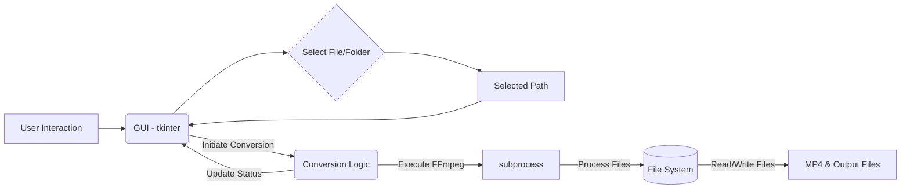

Okay, here is a practical implementation guide for building the MP4 to MP3/AAC audio extraction tool using Python and `tkinter` for the GUI, and `FFmpeg` for the conversion logic.

```markdown
# MP4 Audio Extractor Tool - Implementation Guide

**Version:** 1.0
**Date:** May 13, 2025

## 1. Introduction

This guide outlines the steps and components required to build a simple GUI application in Python that extracts audio tracks from `.mp4` video files and saves them as `.mp3` (or `.aac`) audio files. The tool will support selecting a single file or a folder containing multiple `.mp4` files, processing them, and saving the output files in the same location with the same base name. It is designed to run on Windows 11.

**Prerequisites:**

*   Python 3.x installed.
*   `FFmpeg` installed and accessible from the system's PATH. `FFmpeg` is a powerful command-line tool essential for handling multimedia files. Download from [ffmpeg.org](https://ffmpeg.org/). Ensure the directory containing `ffmpeg.exe` is added to your Windows system's PATH environment variable.

## 2. Component Architecture

The application will follow a basic Model-View-Controller (MVC)-like structure, albeit simplified for a small `tkinter` application.

*   **GUI (`tkinter`):** This acts as the **View** and partially the **Controller**. It handles all user interaction (button clicks, file/folder selection), displays input paths, and shows status messages. It will initiate the conversion process.
*   **Conversion Logic (Python + `subprocess` + `FFmpeg`):** This is the core **Model** logic. It receives file paths, constructs `FFmpeg` commands, executes `FFmpeg` via Python's `subprocess` module, and handles the conversion process. This component should ideally run in a separate thread to prevent the GUI from freezing during conversion.
*   **File System Interaction (`os`, `pathlib`):** Handled within the Conversion Logic or helper functions. Manages listing files in a directory, constructing output paths, checking file existence, etc.



## 3. State Management

The application state will be relatively simple, managed primarily within the GUI class and the background conversion process.

*   `selected_path`: A string storing the currently selected file or folder path. Initial state: empty or `None`.
*   `is_processing`: A boolean flag indicating if a conversion task is currently running. Used to disable buttons or show status. Initial state: `False`.
*   `status_message`: A string displayed in the GUI to provide feedback to the user (e.g., "Select a file or folder", "Processing...", "Completed!", "Error: ..."). Initial state: an introductory message.
*   `files_to_process`: A list of `.mp4` file paths when a folder is selected. Initial state: empty list.
*   `current_file_index`: An integer tracking which file is currently being processed in a folder batch. Initial state: 0.

These states will be updated based on user actions (selecting paths, clicking Convert) and the progress/result of the background conversion process.

## 4. UI Design

The GUI should be simple and functional:

*   **Window Title:** e.g., "MP4 Audio Extractor"
*   **Input Path Display:** A `Label` or read-only `Entry` widget to show the path selected by the user.
*   **Selection Buttons:**
    *   A button labeled "Select File..." which opens a file dialog filtered for `.mp4` files.
    *   A button labeled "Select Folder..." which opens a directory selection dialog.
*   **Convert Button:** A button labeled "Convert Audio". This button should be disabled when no valid path is selected or when a conversion is already in progress.
*   **Status Display:** A `Label` widget to show the current status or progress messages.

**Layout Considerations:**

*   Use a simple layout manager like `pack` or `grid`. `grid` offers more control over alignment and spacing.
*   Place the input path display, selection buttons, convert button, and status display vertically or in a logical flow.
*   Ensure padding (`padx`, `pady`) for better readability.

**User Interactions:**

1.  User clicks "Select File..." or "Select Folder...".
2.  A dialog opens. User chooses a file or folder.
3.  The selected path is displayed. The "Convert Audio" button becomes enabled.
4.  User clicks "Convert Audio".
5.  The "Convert Audio" and selection buttons are disabled. The status message updates to "Processing...".
6.  The background process starts.
7.  Upon completion (success or failure), the status message updates (e.g., "Conversion Complete!", "Error: ..."). Buttons are re-enabled.

## 5. Integration with Conversion Engine (`FFmpeg`)

This section describes the interface between the Python GUI and the external `FFmpeg` tool executed via `subprocess`.

1.  **FFmpeg Command Construction:**
    *   For each input file (`input.mp4`), determine the output path (`output.mp3` or `output.aac`). The output path should be in the same directory as the input file and have the same base name but with the new extension.
    *   Construct the `FFmpeg` command list. A typical command to extract audio to MP3 is:
        ```bash
        ffmpeg -i input.mp4 -vn -acodec libmp3lame -ab 320k output.mp3
        ```
        *   `-i input.mp4`: Specifies the input file.
        *   `-vn`: Disables video recording (extracts only audio).
        *   `-acodec libmp3lame`: Specifies the audio codec for output (MP3). `libmp3lame` is a common encoder. Alternatively, use `aac` for AAC output.
        *   `-ab 320k`: Sets the audio bitrate to 320 kbps (optional, but good practice for quality).
        *   `output.mp3`: Specifies the output file path.
    *   To output to AAC (`.aac`), you might use:
        ```bash
        ffmpeg -i input.mp4 -vn -acodec aac -ab 320k output.aac
        ```
        *Note: Using `-c:a copy` would copy the *original* audio stream if it's AAC, potentially saving time and avoiding re-encoding, but the output container must support raw AAC streams (like ADTS .aac or M4A). Saving to `.mp3` requires re-encoding.* Given the source is AAC, saving to `.aac` with `-c:a copy` and changing container format might be simplest if the goal is an `.aac` file:
         ```bash
         ffmpeg -i input.mp4 -vn -acodec copy -f adts output.aac # Copies the AAC stream into an ADTS container (.aac)
         ```
        Let's provide the MP3 conversion as the primary example, as it's a common target format, and offer AAC conversion as an alternative.

2.  **Executing FFmpeg:**
    *   Use `subprocess.run()` to execute the `FFmpeg` command.
    *   It's crucial to handle this in a separate thread (`threading` module) to prevent the GUI from becoming unresponsive. The main GUI thread should *not* block while waiting for `FFmpeg` to finish.
    *   Capture `stdout` and `stderr` for logging or error reporting (`capture_output=True`, `text=True`).
    *   Check the return code (`result.returncode`). A non-zero code usually indicates an error.
    *   Handle exceptions (e.g., `FileNotFoundError` if `ffmpeg` is not in PATH, `subprocess.CalledProcessError` if `FFmpeg` fails).

3.  **Communicating Status:**
    *   Since the conversion runs in a separate thread, direct calls back to `tkinter` widgets from that thread will cause errors.
    *   Use thread-safe methods to update the GUI, such as:
        *   A queue (`queue` module) where the worker thread puts status messages, and the GUI thread periodically checks the queue (e.g., using `root.after()`).
        *   Using `root.event_generate()` to trigger custom events in the GUI thread that carry status information.
        *   Simplest for basic status: The worker thread can call a method on the GUI object which queues the update to be processed safely in the main thread (e.g., `root.after` used by the GUI method).

## 6. Testing Approach

*   **Unit Tests:**
    *   Test the logic for generating `FFmpeg` commands given input/output paths. Mock `pathlib` or `os` calls if necessary.
    *   Test file path manipulation (e.g., changing extension, getting base name).
*   **Integration Tests:**
    *   Create dummy `.mp4` test files (can be small, even without actual video content, as long as they are valid containers with audio).
    *   Test conversion of a single valid `.mp4` file.
    *   Test conversion of a folder containing multiple valid `.mp4` files.
    *   Test conversion of a folder containing mixed file types (ensure only `.mp4` are processed).
    *   Test with invalid file paths or non-existent files/folders.
    *   Test error handling when `FFmpeg` fails (e.g., corrupt input file, `FFmpeg` not found).
    *   Verify the output files exist, are in the correct location, have the correct name, and are valid audio files (manual check or using an audio library).
*   **GUI Tests:**
    *   Manual testing is sufficient for this simple GUI.
    *   Verify button states (enabled/disabled) change correctly based on selected path and processing status.
    *   Check that status messages are displayed correctly.
    *   Test file/folder dialogs open as expected.
*   **Platform Test:**
    *   Execute the final application on a Windows 11 environment to ensure compatibility, especially with file paths and `subprocess` execution of `FFmpeg`.

## 7. Code Examples

Here are sample implementations of key components using `tkinter`, `pathlib`, `subprocess`, and `threading`.

**7.1. Setting up the Basic GUI Window**

```python
import tkinter as tk
from tkinter import filedialog, messagebox, ttk
import subprocess
import threading
import os
import pathlib

class App(tk.Tk):
    def __init__(self):
        super().__init__()

        self.title("MP4 Audio Extractor")
        self.geometry("500x200")
        self.resizable(False, False)

        self.selected_path = tk.StringVar()
        self.status_message = tk.StringVar()
        self.status_message.set("Select a file or folder to get started.")

        self.create_widgets()
        self.update_button_state() # Initial state

    def create_widgets(self):
        padding = {'padx': 10, 'pady': 5}

        # Input Path Display
        tk.Label(self, text="Selected Path:").grid(row=0, column=0, sticky="w", **padding)
        entry_path = tk.Entry(self, textvariable=self.selected_path, width=50, state='readonly')
        entry_path.grid(row=0, column=1, columnspan=2, sticky="ew", **padding)

        # Selection Buttons
        btn_select_file = tk.Button(self, text="Select File...", command=self.select_file)
        btn_select_file.grid(row=1, column=0, sticky="ew", **padding)

        btn_select_folder = tk.Button(self, text="Select Folder...", command=self.select_folder)
        btn_select_folder.grid(row=1, column=1, sticky="ew", **padding)

        # Convert Button
        self.btn_convert = tk.Button(self, text="Convert Audio", command=self.start_conversion_thread)
        self.btn_convert.grid(row=2, column=0, columnspan=2, sticky="ew", **padding)

        # Status Display
        lbl_status = tk.Label(self, textvariable=self.status_message, anchor="w")
        lbl_status.grid(row=3, column=0, columnspan=3, sticky="ew", **padding)

        # Configure column weights for resizing (optional, but good)
        self.grid_columnconfigure(1, weight=1)
        self.grid_columnconfigure(2, weight=1) # Gives extra space to the entry field side

    # ... (methods for select_file, select_folder, start_conversion_thread, update_button_state, etc. will go here)

if __name__ == "__main__":
    app = App()
    app.mainloop()
```

**7.2. File and Folder Selection**

These methods will be linked to the "Select File..." and "Select Folder..." buttons.

```python
# Inside the App class

    def select_file(self):
        filetypes = (("MP4 files", "*.mp4"), ("All files", "*.*"))
        filepath = filedialog.askopenfilename(
            title="Select an MP4 file",
            initialdir=".", # Start in current directory
            filetypes=filetypes
        )
        if filepath:
            self.selected_path.set(filepath)
            self.update_button_state()
            self.status_message.set(f"Selected file: {os.path.basename(filepath)}")
        else:
            self.status_message.set("File selection cancelled.")

    def select_folder(self):
        folderpath = filedialog.askdirectory(
            title="Select a folder containing MP4 files",
            initialdir="." # Start in current directory
        )
        if folderpath:
            self.selected_path.set(folderpath)
            self.update_button_state()
            self.status_message.set(f"Selected folder: {os.path.basename(folderpath)}")
        else:
            self.status_message.set("Folder selection cancelled.")

    def update_button_state(self):
        # Enable convert button only if a path is selected and not currently processing
        path = self.selected_path.get()
        if path and not self.is_processing:
            self.btn_convert.config(state=tk.NORMAL)
        else:
             self.btn_convert.config(state=tk.DISABLED)

```

**7.3. Preparing and Running FFmpeg (Threaded)**

This involves identifying files, building commands, and executing `FFmpeg` in a separate thread.

```python
# Inside the App class

    def start_conversion_thread(self):
        input_path = self.selected_path.get()
        if not input_path:
            messagebox.showwarning("No Input", "Please select a file or folder first.")
            return

        self.is_processing = True
        self.update_button_state()
        self.status_message.set("Starting conversion...")

        # Create and start the worker thread
        conversion_thread = threading.Thread(target=self.run_conversion, args=(input_path,))
        conversion_thread.start()

    def run_conversion(self, input_path):
        """Runs the FFmpeg conversion logic in a separate thread."""
        try:
            if os.path.isfile(input_path):
                self.process_file(input_path)
                self.after_conversion_complete("Conversion complete!")
            elif os.path.isdir(input_path):
                self.process_folder(input_path)
                self.after_conversion_complete("All conversions complete!")
            else:
                raise FileNotFoundError(f"Invalid path: {input_path}")

        except FileNotFoundError as e:
            self.after_conversion_error(f"Error: {e}")
        except Exception as e:
            self.after_conversion_error(f"An unexpected error occurred: {e}")
        finally:
            # This part runs when the thread finishes (success or failure)
            self.is_processing = False
            # Use root.after to update GUI safely
            self.after(0, self.update_button_state) # Re-enable buttons

    def process_file(self, input_filepath):
        """Processes a single MP4 file."""
        input_path = pathlib.Path(input_filepath)
        output_dir = input_path.parent
        output_name = input_path.stem + ".mp3" # Change extension to .mp3
        output_filepath = output_dir / output_name

        # FFmpeg command to extract audio to MP3
        # Using libmp3lame codec for MP3 output
        ffmpeg_cmd = [
            "ffmpeg",
            "-i", str(input_filepath),
            "-vn",                # No video
            "-acodec", "libmp3lame", # Audio codec for MP3
            "-ab", "320k",         # Audio bitrate
            str(output_filepath)
        ]

        # Alternative command for AAC copy (requires -f adts for .aac container)
        # ffmpeg_cmd_aac = [
        #     "ffmpeg",
        #     "-i", str(input_filepath),
        #     "-vn",
        #     "-acodec", "copy",   # Copy the original audio stream (expecting AAC)
        #     "-f", "adts",        # Output format for .aac files
        #     str(output_dir / (input_path.stem + ".aac"))
        # ]
        # Choose either ffmpeg_cmd or ffmpeg_cmd_aac

        self.update_status_safe(f"Processing: {input_path.name}")

        try:
            # Execute the command
            # suppress_stderr=True might hide useful error info from ffmpeg
            # stdout=subprocess.PIPE, stderr=subprocess.PIPE useful for debugging
            result = subprocess.run(ffmpeg_cmd, check=True, capture_output=True, text=True)
            # Optional: Log result.stdout or result.stderr
            self.update_status_safe(f"Successfully converted: {input_path.name}")

        except FileNotFoundError:
             raise FileNotFoundError("FFmpeg not found. Please ensure ffmpeg is installed and in your system's PATH.")
        except subprocess.CalledProcessError as e:
            # FFmpeg command failed
            error_output = e.stderr.strip() if e.stderr else "No specific error message from FFmpeg."
            raise RuntimeError(f"FFmpeg failed for {input_path.name}: {error_output}")
        except Exception as e:
            # Other potential errors during process execution
            raise RuntimeError(f"Error processing {input_path.name}: {e}")


    def process_folder(self, input_folderpath):
        """Processes all MP4 files in a folder."""
        folder_path = pathlib.Path(input_folderpath)
        mp4_files = list(folder_path.glob("*.mp4")) # Find all .mp4 files

        if not mp4_files:
            self.update_status_safe(f"No .mp4 files found in {folder_path.name}")
            return

        total_files = len(mp4_files)
        self.update_status_safe(f"Found {total_files} .mp4 files. Starting batch conversion...")

        for i, mp4_file in enumerate(mp4_files):
            # Use pathlib.Path objects directly
            input_filepath = mp4_file
            output_dir = input_filepath.parent
            output_name = input_filepath.stem + ".mp3" # Change extension
            output_filepath = output_dir / output_name

            ffmpeg_cmd = [
                "ffmpeg",
                "-i", str(input_filepath),
                "-vn",
                "-acodec", "libmp3lame", # MP3 codec
                "-ab", "320k",
                str(output_filepath)
            ]

            self.update_status_safe(f"[{i+1}/{total_files}] Processing: {input_filepath.name}")

            try:
                result = subprocess.run(ffmpeg_cmd, check=True, capture_output=True, text=True)
                self.update_status_safe(f"[{i+1}/{total_files}] Successfully converted: {input_filepath.name}")
            except FileNotFoundError:
                 # FFmpeg not found error should ideally be caught before batch processing starts
                 # but included here for robustness
                 self.update_status_safe(f"[{i+1}/{total_files}] Error: FFmpeg not found. Aborting batch.")
                 break # Stop processing further files
            except subprocess.CalledProcessError as e:
                error_output = e.stderr.strip() if e.stderr else "No specific error message."
                self.update_status_safe(f"[{i+1}/{total_files}] Error processing {input_filepath.name}: {error_output}")
            except Exception as e:
                self.update_status_safe(f"[{i+1}/{total_files}] Unexpected error for {input_filepath.name}: {e}")


    # --- Thread-safe GUI Update Methods ---

    def update_status_safe(self, message):
        """Updates the status message in the GUI thread."""
        self.after(0, self._update_status, message) # Use root.after to schedule call in main thread

    def _update_status(self, message):
        """Actual method to update the status label (runs in GUI thread)."""
        self.status_message.set(message)

    def after_conversion_complete(self, message):
         """Called when conversion finishes successfully (from worker thread)."""
         self.after(0, self._show_completion_message, message)

    def _show_completion_message(self, message):
        """Displays completion message (runs in GUI thread)."""
        self.status_message.set(message)
        messagebox.showinfo("Conversion Complete", message)

    def after_conversion_error(self, message):
        """Called when conversion encounters an error (from worker thread)."""
        self.after(0, self._show_error_message, message)

    def _show_error_message(self, message):
        """Displays error message (runs in GUI thread)."""
        self.status_message.set(message)
        messagebox.showerror("Conversion Error", message)

```

**Complete Example Structure:**

```python
# app.py

import tkinter as tk
from tkinter import filedialog, messagebox, ttk
import subprocess
import threading
import os
import pathlib

class App(tk.Tk):
    def __init__(self):
        super().__init__()

        self.title("MP4 Audio Extractor")
        self.geometry("500x200")
        self.resizable(False, False)

        self.selected_path = tk.StringVar()
        self.status_message = tk.StringVar()
        self.status_message.set("Select a file or folder to get started.")

        self.is_processing = False # State variable for processing status

        self.create_widgets()
        self.update_button_state() # Initial state

    def create_widgets(self):
        padding = {'padx': 10, 'pady': 5}

        tk.Label(self, text="Selected Path:").grid(row=0, column=0, sticky="w", **padding)
        entry_path = tk.Entry(self, textvariable=self.selected_path, width=50, state='readonly')
        entry_path.grid(row=0, column=1, columnspan=2, sticky="ew", **padding)

        btn_select_file = tk.Button(self, text="Select File...", command=self.select_file)
        btn_select_file.grid(row=1, column=0, sticky="ew", **padding)

        btn_select_folder = tk.Button(self, text="Select Folder...", command=self.select_folder)
        btn_select_folder.grid(row=1, column=1, sticky="ew", **padding)

        self.btn_convert = tk.Button(self, text="Convert Audio", command=self.start_conversion_thread)
        self.btn_convert.grid(row=2, column=0, columnspan=2, sticky="ew", **padding)

        lbl_status = tk.Label(self, textvariable=self.status_message, anchor="w")
        lbl_status.grid(row=3, column=0, columnspan=3, sticky="ew", **padding)

        self.grid_columnconfigure(1, weight=1)
        self.grid_columnconfigure(2, weight=1)

    def select_file(self):
        if self.is_processing: return # Prevent interaction while processing
        filetypes = (("MP4 files", "*.mp4"), ("All files", "*.*"))
        filepath = filedialog.askopenfilename(
            title="Select an MP4 file",
            initialdir=os.path.dirname(self.selected_path.get()) if self.selected_path.get() else ".",
            filetypes=filetypes
        )
        if filepath:
            self.selected_path.set(filepath)
            self.update_button_state()
            self.status_message.set(f"Selected file: {os.path.basename(filepath)}")
        else:
            self.status_message.set("File selection cancelled.")
            # Keep previous selection/state if cancelled after selecting
            if not self.selected_path.get():
                 self.update_button_state()


    def select_folder(self):
        if self.is_processing: return # Prevent interaction while processing
        folderpath = filedialog.askdirectory(
            title="Select a folder containing MP4 files",
            initialdir=self.selected_path.get() if os.path.isdir(self.selected_path.get()) else (os.path.dirname(self.selected_path.get()) if self.selected_path.get() else ".")
        )
        if folderpath:
            self.selected_path.set(folderpath)
            self.update_button_state()
            self.status_message.set(f"Selected folder: {os.path.basename(folderpath)}")
        else:
            self.status_message.set("Folder selection cancelled.")
            # Keep previous selection/state if cancelled after selecting
            if not self.selected_path.get():
                 self.update_button_state()


    def update_button_state(self):
        # Enable convert button only if a path is selected and not currently processing
        path = self.selected_path.get()
        # Check if path exists and is a file or directory
        path_valid = os.path.exists(path) and (os.path.isfile(path) or os.path.isdir(path))

        if path_valid and not self.is_processing:
            self.btn_convert.config(state=tk.NORMAL)
        else:
            self.btn_convert.config(state=tk.DISABLED)

        # Disable selection buttons while processing
        select_buttons = [widget for widget in self.winfo_children() if isinstance(widget, tk.Button) and ("Select" in widget.cget('text'))]
        for btn in select_buttons:
             if self.is_processing:
                 btn.config(state=tk.DISABLED)
             else:
                 btn.config(state=tk.NORMAL)


    def start_conversion_thread(self):
        input_path = self.selected_path.get()
        if not input_path or not os.path.exists(input_path):
            messagebox.showwarning("No Input", "Please select a valid file or folder first.")
            return

        self.is_processing = True
        self.update_button_state()
        self.status_message.set("Starting conversion...")

        # Create and start the worker thread
        conversion_thread = threading.Thread(target=self.run_conversion, args=(input_path,), daemon=True) # daemon=True lets thread exit with app
        conversion_thread.start()


    def run_conversion(self, input_path):
        """Runs the FFmpeg conversion logic in a separate thread."""
        try:
            if os.path.isfile(input_path):
                if input_path.lower().endswith(".mp4"):
                    self.process_file(input_path)
                    self.after_conversion_complete("Conversion complete!")
                else:
                     raise ValueError(f"Selected file is not an MP4: {os.path.basename(input_path)}")
            elif os.path.isdir(input_path):
                self.process_folder(input_path)
                self.after_conversion_complete("All conversions complete!")

        except FileNotFoundError as e:
             # This should ideally indicate FFmpeg not found
             self.after_conversion_error(f"Error: {e}\nPlease ensure FFmpeg is installed and in your system's PATH.")
        except ValueError as e:
            self.after_conversion_error(f"Input Error: {e}")
        except Exception as e:
            self.after_conversion_error(f"An unexpected error occurred: {e}")
        finally:
            # This part runs when the thread finishes (success or failure)
            self.is_processing = False
            # Use root.after to update GUI safely
            self.after(0, self.update_button_state) # Re-enable buttons


    def process_file(self, input_filepath):
        """Processes a single MP4 file."""
        input_path = pathlib.Path(input_filepath)
        output_dir = input_path.parent
        # Output as MP3
        output_name = input_path.stem + ".mp3"
        output_filepath = output_dir / output_name

        # FFmpeg command to extract audio to MP3 (using libmp3lame)
        ffmpeg_cmd = [
            "ffmpeg",
            "-i", str(input_filepath),
            "-vn",                # No video
            "-acodec", "libmp3lame", # Audio codec for MP3
            "-ab", "320k",         # Audio bitrate 320kbps
            "-map_metadata", "-1",  # Remove metadata
            "-y",                 # Overwrite output file without asking
            str(output_filepath)
        ]

        # --- Alternative: Copy AAC stream to .aac file ---
        # If you prefer to save as .aac and the source is AAC as described:
        # ffmpeg_cmd = [
        #     "ffmpeg",
        #     "-i", str(input_filepath),
        #     "-vn",                # No video
        #     "-acodec", "copy",   # Copy the audio stream
        #     "-f", "adts",        # Output format (ADTS stream for .aac files)
        #     "-map_metadata", "-1", # Remove metadata
        #     "-y",                 # Overwrite output file
        #     str(output_dir / (input_path.stem + ".aac")) # Output .aac file
        # ]


        self.update_status_safe(f"Processing: {input_path.name}")

        try:
            # Execute the command
            # Use creationflags=subprocess.CREATE_NO_WINDOW on Windows to hide the console window
            creationflags = 0
            if os.name == 'nt': # Check if on Windows
                creationflags = subprocess.CREATE_NO_WINDOW

            result = subprocess.run(
                ffmpeg_cmd,
                check=True,
                capture_output=True,
                text=True,
                creationflags=creationflags # Hide console on Windows
            )
            # Optional: print(result.stdout, result.stderr) for debugging

            if os.path.exists(output_filepath): # Verify output file created
                 self.update_status_safe(f"Successfully converted: {input_path.name}")
            else:
                 raise RuntimeError(f"FFmpeg finished, but output file not found: {output_filepath}")


        except FileNotFoundError:
             # This specific error from subprocess.run means the executable (ffmpeg) was not found
             raise FileNotFoundError("FFmpeg command not found. Is it installed and in your system's PATH?")
        except subprocess.CalledProcessError as e:
            # FFmpeg command failed (returned non-zero exit code)
            error_output = e.stderr.strip() if e.stderr else "No specific error message from FFmpeg."
            raise RuntimeError(f"FFmpeg failed for {input_path.name}. Error: {error_output}")
        except Exception as e:
            # Other potential errors during process execution or file handling
            raise RuntimeError(f"Error processing {input_path.name}: {e}")


    def process_folder(self, input_folderpath):
        """Processes all MP4 files in a folder."""
        folder_path = pathlib.Path(input_folderpath)
        # Find all files ending with .mp4 case-insensitively
        mp4_files = [f for f in folder_path.iterdir() if f.is_file() and f.suffix.lower() == '.mp4']

        if not mp4_files:
            self.update_status_safe(f"No .mp4 files found in {folder_path.name}")
            return

        total_files = len(mp4_files)
        self.update_status_safe(f"Found {total_files} .mp4 files. Starting batch conversion...")

        for i, mp4_file in enumerate(mp4_files):
            # Use pathlib.Path objects directly
            input_filepath = mp4_file
            output_dir = input_filepath.parent
            output_name = input_filepath.stem + ".mp3" # Change extension
            output_filepath = output_dir / output_name

            ffmpeg_cmd = [
                "ffmpeg",
                "-i", str(input_filepath),
                "-vn",
                "-acodec", "libmp3lame", # MP3 codec
                "-ab", "320k",
                "-map_metadata", "-1", # Remove metadata
                "-y",                 # Overwrite
                str(output_filepath)
            ]

            # --- Alternative: Copy AAC stream to .aac file ---
            # ffmpeg_cmd = [
            #     "ffmpeg",
            #     "-i", str(input_filepath),
            #     "-vn",
            #     "-acodec", "copy",
            #     "-f", "adts",
            #     "-map_metadata", "-1",
            #     "-y",
            #     str(output_dir / (input_filepath.stem + ".aac"))
            # ]


            self.update_status_safe(f"[{i+1}/{total_files}] Processing: {input_filepath.name}")

            try:
                # Hide console on Windows
                creationflags = 0
                if os.name == 'nt':
                    creationflags = subprocess.CREATE_NO_WINDOW

                result = subprocess.run(
                    ffmpeg_cmd,
                    check=True,
                    capture_output=True,
                    text=True,
                    creationflags=creationflags
                )

                if os.path.exists(output_filepath): # Verify output file created
                    self.update_status_safe(f"[{i+1}/{total_files}] Successfully converted: {input_filepath.name}")
                else:
                    self.update_status_safe(f"[{i+1}/{total_files}] FFmpeg finished, but output file not found: {output_filepath}. Check FFmpeg output for details.")
                    # Don't raise exception here, just report error and continue with next file


            except FileNotFoundError:
                 # FFmpeg not found - catastrophic, stop batch processing
                 self.update_status_safe(f"[{i+1}/{total_files}] Error: FFmpeg command not found. Aborting batch.")
                 raise # Re-raise to be caught by run_conversion's exception handler
            except subprocess.CalledProcessError as e:
                error_output = e.stderr.strip() if e.stderr else "No specific error message."
                self.update_status_safe(f"[{i+1}/{total_files}] Error processing {input_filepath.name}: {error_output}")
                # Continue with the next file after logging the error
            except Exception as e:
                self.update_status_safe(f"[{i+1}/{total_files}] Unexpected error for {input_filepath.name}: {e}")
                # Continue with the next file


    # --- Thread-safe GUI Update Methods ---

    def update_status_safe(self, message):
        """Updates the status message in the GUI thread."""
        # Use root.after to schedule call in main thread
        self.after(0, self._update_status, message)

    def _update_status(self, message):
        """Actual method to update the status label (runs in GUI thread)."""
        self.status_message.set(message)
        self.update() # Force GUI update

    def after_conversion_complete(self, message):
         """Called when conversion finishes successfully (from worker thread)."""
         self.after(0, self._show_completion_message, message)

    def _show_completion_message(self, message):
        """Displays completion message (runs in GUI thread)."""
        self.status_message.set(message)
        messagebox.showinfo("Conversion Complete", message)
        self.selected_path.set("") # Clear path after success? Optional.


    def after_conversion_error(self, message):
        """Called when conversion encounters an error (from worker thread)."""
        self.after(0, self._show_error_message, message)

    def _show_error_message(self, message):
        """Displays error message (runs in GUI thread)."""
        self.status_message.set(message)
        messagebox.showerror("Conversion Error", message)
        # Maybe keep the selected path visible after error? Yes.


if __name__ == "__main__":
    app = App()
    app.mainloop()
```

This guide provides the structure, necessary components, and practical code examples to build the MP4 audio extractor tool. Remember to install `FFmpeg` and add it to your system's PATH for the code to function correctly.
